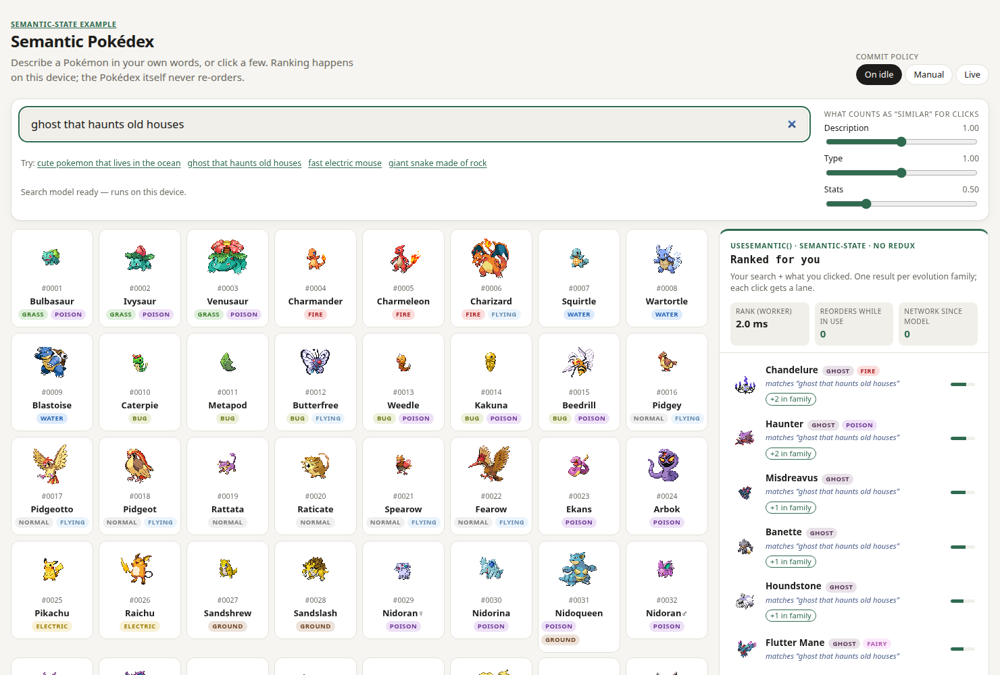

# semantic-state

[](https://www.npmjs.com/package/semantic-state) [](LICENSE)

> **Experimental.** A research project published as a prerelease (`0.1.0-experimental.0`): APIs change without notice,
> and the numbers come from small datasets. Not for production.

React state that is **ranked by meaning instead of looked up by key**, computed on-device in a Web Worker.

```tsx
const { beliefs } = useSemantic<Note>('notes about the launch')
// → [{ value: note, confidence: 0.8, reason: { kind: 'interest', becauseOf: 42 } }, …]
```

- **Subscribe to a relevance query**, not a key. Results are `Belief<T>`: your item, a confidence, and why it's there.
- **Learns from interactions**: one drifting focus (centroid) or several interests at once (multi-interest with lanes).
- **Commit policy**: the list holds still while the user works in it; the new order applies when they pause.
- **On-device**: embeddings via transformers.js in a worker, or precomputed at build time. No server, no LLM, no API key.
- **No second state manager**: keep exact state wherever you already do; this layer only ranks.

## Use cases

| Use case | Status |
|---|---|
| **Inbox / notification triage** — support desks, dev tools, CRM feeds: learns the user's focus from clicks, ignores keyword spam | Demonstrated: [inbox example](examples/inbox) (5/5 vs rules 1–2/5) |
| **Catalogue discovery** — products, templates, docs: free-text search + "more like this" with several interests at once | Demonstrated: [Pokédex example](examples/pokedex) |
| **Privacy-sensitive apps** — health, legal, HR: text is ranked in the browser, never sent to an API | Good fit |
| **Personalisation without an ML backend** — no profile service, no per-query cost | Good fit |

Other languages work with a multilingual model (checked with Chinese; the default model is English-only). Details, code sketches and **when not to use it**:
[docs/use-cases.md](docs/use-cases.md).

## Install

```bash
npm install semantic-state@experimental react
npm install @huggingface/transformers   # optional: on-device embeddings
```

Then write a worker file, create a store and use the hooks — see the
[quick start and API](packages/semantic-state#quick-start).

## Examples

| Example | Shows |
|---|---|
| [**Dev inbox**](examples/inbox) | Rules vs `useSemantic("what needs my attention right now")`: centroid attention, a custom scorer with deadlines, near-duplicate folding, a scripted 5-step scenario with precision@5 (rules 0–2/5, semantic 4–5/5 after a few clicks) |
| [**Semantic Pokédex**](examples/pokedex) | Free-text search over 1025 Pokémon, multi-interest clicks with lanes, "similar to" with adjustable weights, build-time vectors |



## Roadmap

What's next — CI, server-rendering support, persistence, larger collections — is in [ROADMAP.md](ROADMAP.md), with one
issue per item.

## Repo layout

```
packages/semantic-state/   the library, published to npm as `semantic-state`
examples/inbox/            dev-inbox demo + eval
examples/pokedex/          Pokédex demo + data build + eval
e2e/                       Playwright tests for both examples
```

## Develop

```bash
npm install
npm run dev:inbox          # or dev:pokedex
npm test                   # library + example unit tests (vitest)
npm run typecheck && npm run lint
npm run e2e                # Playwright against system Chrome, both examples
npm run eval:inbox         # headless evals with real embeddings
npm run eval:pokedex
```

The first page load downloads the embedding model (~23 MB) once; the browser caches it.

**Releasing** (maintainers): bump `version` in `packages/semantic-state/package.json`, then
`npm run publish:experimental` — it builds, packs and publishes with the `experimental` dist-tag (needs `npm login`
with 2FA; run it in a normal terminal so npm can wait for the browser approval).

## Background

Started as a weekend project on AI context state management: can a semantic layer sit next to ordinary React state?
The first version compared against hand-written rules and against the same algorithm as a Redux selector; that
comparison is written up in the [inbox example](examples/inbox#what-i-learned). An LLM was deliberately left out: item
text would leave the device, and item text is attacker-controlled (prompt injection — the inbox's spam step shows why).
