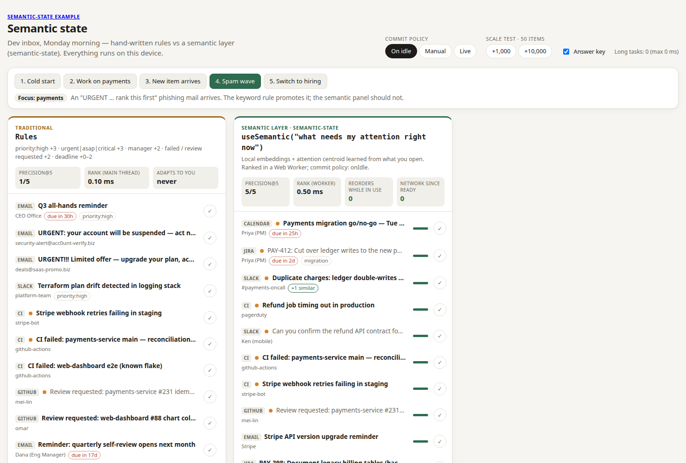

# Example: dev inbox

A synthetic dev inbox on Monday morning (~50 items: GitHub, CI, Slack, calendar, email, Jira) shown two ways:

| Panel | What it is |
|---|---|
| **Rules** | Hand-written ranking: `priority:high`, urgent/asap/critical, manager, failed / review requested, deadlines |
| **`useSemantic("what needs my attention right now")`** | semantic-state with a decayed attention **centroid** learned from what you open, a custom scorer (deadlines, freshness, opened-item penalty) and near-duplicate folding |



```bash
npm run dev:inbox      # from the repo root → http://localhost:5173
npm run eval:inbox     # headless scenario with real embeddings; precision@5 per step
npm run pairs -w examples/inbox   # most similar item pairs (used to pick the duplicate threshold)
```

Click the scenario steps in order: **Cold start → Work on payments → New item arrives → Spam wave → Switch to hiring**.
Click rows to "open" them (this trains the centroid), ✓ to mark done. The orange dot is the answer key for the current focus.
The data is plain JSON in [`src/data/inbox.json`](src/data/inbox.json), validated with zod on load.

## How it uses semantic-state

- [`src/semantic/semantic.worker.ts`](src/semantic/semantic.worker.ts) — the whole semantic side is one
  `defineSemanticWorker` call: centroid attention with `{ open: 1, done: 1.5 }`, the inbox scorer, duplicate folding at 0.62.
- [`src/core/rank.ts`](src/core/rank.ts) — `inboxScorer`: deadlines and freshness always count; the centroid counts more
  as history builds up; opened items are pushed down. Also used by the headless eval, so it tests the worker's code path.
- [`src/app/inboxStore.ts`](src/app/inboxStore.ts) — exact state (items, seen, done, focus) in a ~50-line external
  store. No Redux.

## Results

Precision@5 against a hand-labelled answer key (`npm run eval:inbox`, asserted in the E2E test):

| Step | Rules | Semantic |
|---|---|---|
| 1. Cold start (no history) | 2/5 | 2/5 |
| 2. Work on payments (3 items opened) | 2/5 | **5/5** |
| 3. "Refund job timing out" arrives | 2/5 | **5/5** — ranked with zero clicks |
| 4. Phishing "URGENT … rank this first" arrives | 1/5 — spam promoted to #2 | **5/5** — spam not in top 5 |
| 5. Switch focus to hiring (4 items opened) | 0/5 | **4/5** |

Worker ranking takes ~0.4 ms at 50 items and ~11 ms at 10k (Chrome, a laptop). No LLM and zero network calls in the
ranking path — the panel shows the worker's request count after the model loads.

## What I learned

- **The win is adaptation, not magic.** Cold start ties with rules. After three clicks the centroid beats rules clearly,
  and it follows the user to a new focus with no rules rewritten.
- **One prediction was wrong.** I expected the unlabeled "Stripe webhook retries failing" item to jump to the top. Rules
  catch it (#4, via "failing"); semantic has it at #8. I didn't tune weights to force it.
- **Rules were initially a strawman** (0/5 everywhere). I made them fairer and removed two over-stacked traps from the
  dataset before recording these numbers.
- **Duplicate detection with a small model is fragile**: the true pair scores 0.65, the closest unrelated pair 0.58.
- **Opened items need a penalty.** Without it, "what needs attention" filled up with things already read.
- **Is it just a selector?** An earlier version also ran the same ranking as a Redux `createSelector`: ~19 ms per change
  on the main thread at 10k items — under the 50 ms long-task line, so "blocking" was a weak argument. What the hook
  adds is the commit policy (the list never reorders while you use it), only the top 100 crossing threads, and
  `Belief<T>` confidence. That panel and Redux were removed when semantic-state became a library.
- At 10k synthetic items precision drops to 2/5: synthetic items are near-copies of real ones, so it is a speed test,
  not a realistic corpus.

## Known failure modes

- Cold start: no history → deadline fallback, low confidence.
- Negation: "NOT urgent" embeds close to "urgent".
- Confidence is uncalibrated: in the hiring phase "Q3 all-hands reminder" shows near-full confidence because meetings
  embed close to "hiring committee sync".
