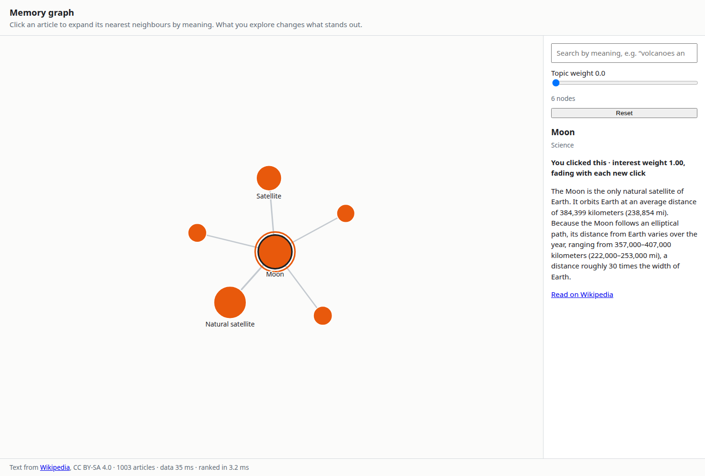

# Memory graph

Explore ~1000 Wikipedia articles (the [Level 3 vital articles](https://en.wikipedia.org/wiki/Wikipedia:Vital_articles/Level/3))
by meaning. Click an article and its 5 nearest neighbours appear; what you've explored changes how every node looks.



```bash
npm run dev:graph        # from the repo root
npm run eval:graph       # neighbour quality + baseline timings
```

## What you're looking at

Two layers, from two parts of semantic-state:

| Layer | Drawn as | Comes from |
|---|---|---|
| **Structure** | nodes and edges; edge width = similarity | `store.requestSimilar(id, 5)` for each expanded article (`useNeighbors`) |
| **Attention** | size, colour, ring | `useSemantic(query)` in multi-interest mode |

| Visual | Meaning |
|---|---|
| Large node with a ring | an article you clicked; the ring fades as the interest decays |
| Node size | `confidence` of the belief (8–28 px) |
| Colour | which click made it relevant (one colour per interest lane); dark grey = matches your search; light grey = no strong signal |
| Edge | nearest-neighbour link; wider = more similar |

The detail panel prints the same explanation the node is drawn from (`src/graph/encoding.ts`).

**The graph holds still while you work in it.** The library's commit policy holds a list's *order*; a graph shows
*values*, so `useHeldVisuals` holds sizes and colours while the pointer is active and applies them when it rests or
leaves ("N changes pending").

**Search jumps to the best match for the text itself.** The worker's ranking blends the query with your interests
(60/40), which is right for "what stands out" but would let an unrelated click weaken or redirect an explicit search.
So the search seed is chosen by query-to-article similarity alone (the worker sends query vectors with
`emitVectors`); below 0.3 you get "Only weak matches" instead of a jump.

**Topic weight** blends a one-hot topic vector into similarity: at 0 neighbours are pure meaning, at 1 they stay
within their topic.

## Data

`public/wiki/` is built by `npm run build:data -w examples/memory-graph` from the MediaWiki API and committed.
Vectors are computed at build time, so the page loads no model until you search.

Loading goes through `ArticleSource` (`src/source.ts`), and vectors reach the worker with
`store.upsert(articles, { vectors })`. Only the prebuilt source exists today; a live Wikipedia source (the worker
embeds on load) plus IndexedDB caching is a planned follow-up, measured against this baseline:

| Baseline (prebuilt, local dev server) | |
|---|---|
| Articles + vectors fetched and decoded in the browser | 25 ms |
| Ranking all 1003 articles in the worker (`rankMs`) | 8.7 ms |
| Neighbours of one article (`eval:graph`, median) | 1.9 ms |
| Neighbour quality (`eval:graph`) | 10/10 sources have an expected article in their top 5 |

## Licence

Article text is from Wikipedia, licensed [CC BY-SA 4.0](https://creativecommons.org/licenses/by-sa/4.0/); see
`public/wiki/LICENSE.md`. Code is MIT.
