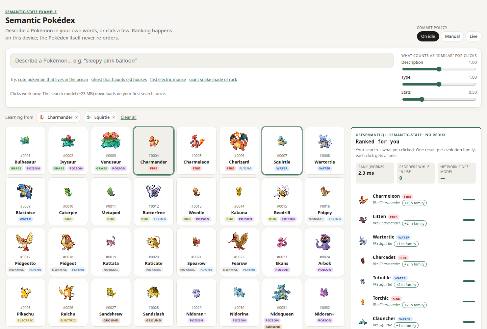

# Example: semantic Pokédex

All 1025 Pokémon. Describe one in your own words, or click a few; a **Ranked for you** panel learns from both, while the
Pokédex grid itself never re-orders (people expect #0001 → #1025).



```bash
npm run dev:pokedex    # from the repo root → http://localhost:5173
npm run eval:pokedex   # search / multi-interest / weight checks on the real data
npm run build:data -w examples/pokedex   # re-download PokeAPI CSVs and rebuild public/pokedex/ (~3 s; output is committed)
```

## How it uses semantic-state

- [`src/pokedex.worker.ts`](src/pokedex.worker.ts) — one `defineSemanticWorker` call: **precomputed** vectors
  (`fetchVectorFile`), extra `features` (type one-hot, stat-spread shape), **multi-interest** attention, grouping by
  evolution family.
- [`src/PokedexApp.tsx`](src/PokedexApp.tsx) — `useSemantic(query)` for the ranked panel, `useSimilar(id)` for
  "Similar to X", `store.setWeights` for the sliders. No other state library.
- [`scripts/build-pokedex.ts`](scripts/build-pokedex.ts) — PokeAPI CSVs → `pokedex.json` (416 KB) and `vectors.bin`
  (1.6 MB, embedded in Node with the same model). Clicks work instantly; the model (~23 MB) downloads only on the first
  search.

## Results (`npm run eval:pokedex`)

| Check | Result |
|---|---|
| Free-text search, share of top 10 with the expected type (8 queries) | **0.91** — e.g. “ghost that haunts old houses” → Chandelure, Haunter, Misdreavus, Banette |
| Click Squirtle, then Charmander — single averaged centroid | 0% water, 100% fire |
| Same clicks — multi-interest + lanes | **40% water, 60% fire** (Charmeleon, Litten, Wartortle, Charcadet, Totodile…) |
| Similar to Pikachu, description only / type only / stats only | Pawmot, Sandslash… / Jolteon, Raikou… / Diglett, Meowth… |

## What I learned

- **Taking the max over interests is not enough.** The newest click has the highest weight, so it won every slot.
  Fixed with interest lanes (each extra pick from one lane ×0.8) — now built into semantic-state.
- **A second bug hid behind the first.** The commit policy re-sorts by score, which silently undid the lane order in the
  browser while the Node eval looked fine. Lanes now emit their discounted score. Only the E2E test caught it.
- **Stats-only similarity is technically right and useless** (Pikachu ≈ Diglett). "Similar" needs a human-chosen blend.
- **Text models miss some combinations**: “frozen bird” returns flying types but no Articuno.

Data from [PokeAPI](https://pokeapi.co). Pokémon names and sprites © Nintendo / Game Freak / Creatures; sprites are
loaded at runtime from the PokeAPI sprites repo (not stored here). Personal, non-commercial demo.
